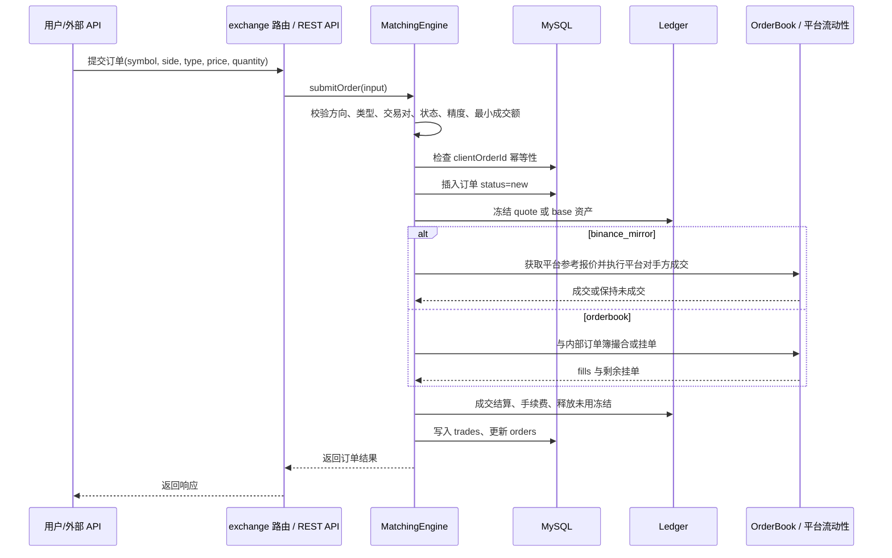

# Walldex / Dex 产品说明与技术理解文档

**文档版本**：v1.0  
**代码基线**：`aca47b5d2c8c78955cb7008938e2124ceb9efb4c`  
**目标仓库**：[https://github.com/WrbMax/dex](https://github.com/WrbMax/dex)  
**适用对象**：前端工程师、后端工程师、测试工程师、运维工程师、安全工程师、产品技术负责人、后续接手项目的全栈开发人员  
**作者**：Manus AI  
**日期**：2026-05-18

## 1. 文档目的与阅读方式

本文档是一份面向技术人员的**完整产品说明与技术理解文档**。它不是普通的用户手册，也不是只给产品经理看的功能清单，而是为了让任何接手该项目的技术人员能够快速理解 Walldex/Dex 的产品目标、系统边界、前后端模块、核心数据模型、交易撮合机制、资金账本模型、外部 API、部署运行方式、测试重点以及后续维护风险。

Walldex/Dex 当前是一个基于 React、Express、tRPC、Drizzle ORM 和 MySQL 的现货交易平台项目。代码仓库以 `wallet-dex-exchange` 为包名，提供前端交易界面、用户资产与订单系统、管理员后台、内部撮合引擎、平台流动性成交模式、Binance 行情镜像能力、外部 REST API、API Key 管理、通知系统、审计日志和部署脚本等能力。[1] [2]

建议新成员不要直接从代码文件逐个阅读，而应先按照下表的路径理解整体边界，再深入自己负责的模块。

| 阅读对象 | 首先阅读章节 | 重点关注内容 | 建议随后阅读的源码 |
|---|---:|---|---|
| 前端工程师 | 第 4、5、10、11 章 | 页面路由、交易页状态机、管理后台信息架构、API Key 页面、tRPC 调用方式 | `client/src/pages/TradePair.tsx`、`AdminPanel.tsx`、`ApiKeys.tsx`、`ApiDocs.tsx` |
| 后端工程师 | 第 6、7、8、9、10、12 章 | Express/tRPC/REST 入口、数据库模型、撮合引擎、账本、订单生命周期、API 认证 | `server/_core/index.ts`、`server/routers/exchange.ts`、`server/routers/admin.ts`、`server/exchange/matching/engine.ts` |
| 测试工程师 | 第 9、10、15 章 | 资金冻结/释放、成交、撤单、市场模式隔离、API 签名、边界条件 | `tests` 目录、`server/exchange` 相关服务 |
| 运维工程师 | 第 13、14、16 章 | 环境变量、构建、PM2、Nginx、MySQL、日志、健康检查、备份 | `README.md`、`ecosystem.config.json`、部署脚本 |
| 安全工程师 | 第 8、11、12、16、17 章 | API Key、HMAC 签名、IP 白名单、管理员权限、审计日志、资金操作风险 | `rest.ts`、`admin.ts`、`schema.ts` |
| 技术负责人 | 全文 | 产品边界、系统不变量、扩展路线、上线风险、模块分工 | 全仓库 |

> **重要说明**：本文档基于当前仓库代码与已验证的测试服务器状态编写。它用于帮助理解和维护项目，不等同于安全审计报告、合规报告或生产上线许可。若项目用于真实资金环境，仍需进行独立的安全审计、风控审计、资金对账审计和压力测试。

## 2. 产品定位

Walldex/Dex 的核心定位是一个**中心化账本式现货交易平台**，并带有 DEX/钱包风格的产品体验。用户在前端完成登录、查看行情、管理资产、充值提现、划转、下单、撤单和查询历史记录；管理员在后台维护交易对、市场模式、用户资产、订单、充值、提现、API Key、风控设置和审计日志；外部开发者可以通过 REST API 获取行情、查询账户、下单、撤单和查询成交。

从业务实现角度看，当前系统不是一个完全链上撮合的 DEX。它更接近**带有钱包入口和链上充值提现概念的中心化交易系统**：资产余额由数据库中的账户表和账本流水维护，订单由后端撮合引擎处理，成交写入数据库，外部行情可镜像 Binance，部分交易对可以选择平台作为自动成交对手方。数据库 schema 中的 `asset_accounts`、`ledger_entries`、`orders`、`trades`、`deposits`、`withdrawals` 和 `transfers` 构成了核心资金与交易模型。[5]

| 维度 | 当前实现说明 |
|---|---|
| 产品类型 | 中心化账本式现货交易平台，前端呈现为钱包/交易所产品 |
| 交易品类 | 现货交易对，典型形式为 `BASE/QUOTE`，如 `BTCUSDT`、`ETHUSDT` 等 |
| 交易模式 | 支持 `binance_mirror` 平台流动性模式与 `orderbook` 内部订单簿模式，两者在撮合引擎中被明确隔离。[8] |
| 资金模型 | 用户拥有子账户与资产账户，余额分为可用余额与锁定余额；资金变化通过账本流水记录。[5] |
| 行情来源 | 可使用内部撮合行情，也可以从 Binance REST/WebSocket 镜像行情、盘口、成交和 ticker。[9] |
| 外部 API | 提供类 Binance 风格的 `/api/v1` REST API，支持公开行情与签名交易接口。[9] |
| 管理后台 | 支持用户、订单、成交、资金、市场、API Key、风险、系统和日志等运营管理能力。[7] [11] |
| 运行方式 | 开发模式使用 `tsx watch server/_core/index.ts`，生产模式构建后运行 `dist/index.js`，PM2 配置文件为 `ecosystem.config.json`。[2] [14] |

## 3. 核心业务对象与角色

系统中的主要角色可以分为访问者、普通用户、API 用户、管理员、运维人员和平台系统账户。不同角色对应不同的产品入口、权限边界和风险点。

| 角色 | 产品入口 | 主要能力 | 风险边界 |
|---|---|---|---|
| 访问者 | 首页、行情页、API 文档页 | 浏览公开行情、交易对信息、API 文档 | 不应访问私有账户、订单、后台数据 |
| 普通用户 | 登录后用户中心、交易页、资产页 | 查询余额、充值、提现、划转、下单、撤单、查看订单和成交 | 所有资金操作必须绑定用户身份和子账户 |
| API 用户 | `/me/api-keys` 与 `/api/v1` | 创建 API Key，使用 HMAC 签名访问账户、订单和交易接口 | API Key 只允许授权范围内操作，withdraw 当前禁用 |
| 管理员 | `/admin`、`/admin-panel` | 管理用户、订单、市场、费用、提现、风控、日志等 | 管理动作必须进行权限校验和审计记录 |
| 运维人员 | 服务器、PM2、Nginx、数据库、日志 | 部署、升级、备份、监控、故障恢复 | 不应直接绕过账本修改资金，生产修改须留痕 |
| 平台系统账户 | 撮合引擎内部约定 | 在平台流动性模式下作为成交对手方，代码中使用 `userId=0` 表示平台方 | 必须在报表、风控、对账中与真实用户区分 |

其中最需要重点理解的是**普通用户资产账户**、**管理员资金操作**和**平台系统账户**之间的区别。普通用户资金由 `asset_accounts` 和 `ledger_entries` 共同表达；管理员可以通过后台进行资产调整、提现审批、市场配置等高权限动作；平台系统账户在 `binance_mirror` 模式下参与成交记录，但它不是一个普通登录用户，而是平台作为流动性对手方的业务标识。[5] [7] [8]

## 4. 产品功能全景

从用户体验上看，Walldex/Dex 包含四条主线：行情浏览、交易下单、资产管理、运营管理。它们共享同一套后端服务和数据库模型，但面对的用户角色和风险等级不同。

| 功能域 | 子功能 | 前端入口 | 后端能力 |
|---|---|---|---|
| 行情与市场 | 市场列表、ticker、K 线、盘口、最近成交、交易对元数据 | 首页、市场页、交易页、API 文档 | 市场注册表、行情 Hub、Binance 镜像、订单簿深度接口 |
| 交易 | 限价单、市价单、买入、卖出、撤单、开放订单、历史订单、成交历史 | `/trade/:symbol` | `exchange.submitOrder`、`exchange.cancelOrder`、撮合引擎、账本冻结与结算 |
| 资产 | 余额、充值地址、充值记录、提现申请、划转、资金流水 | 用户中心、资产相关页面 | 账户账本、充值提现表、划转表、提现审批服务 |
| API | API Key 创建、权限控制、IP 白名单、REST 签名接口、API 文档 | `/me/api-keys`、`/docs/api` | API Key 服务、HMAC-SHA256 认证、REST v1 接口、限流 |
| 管理后台 | 概览、用户、订单、成交、充值、提现、账本、费用、市场、API Key、风险、系统、日志 | `/admin`、`/admin-panel` | `adminProcedure` 权限校验、管理员路由、审计日志、市场配置、资金调整 |
| 通知 | 订单成交、撤单等用户通知 | 用户端通知区域 | `user_notifications` 表与通知服务 |
| 运维 | 构建、启动、PM2、Nginx、数据库迁移、测试 | 服务器与命令行 | `pnpm build`、`pnpm start`、`pnpm db:push`、PM2 配置 |

前端页面中，交易页 `/trade/:symbol` 是普通用户最核心的业务页面。该页面根据 URL 中的 `symbol` 推导交易对，拉取市场元数据、ticker、盘口、余额和开放订单；用户可以在买卖方向、限价/市价类型之间切换，输入价格与数量，并执行下单或撤单。[10]

管理后台则是运营人员的核心入口。`AdminPanel.tsx` 中的导航结构将后台拆分为 `overview`、`users`、`orders`、`trades`、`deposits`、`withdrawals`、`ledger`、`fees`、`markets`、`apiKeys`、`risk`、`system` 和 `logs` 等模块，这些模块基本覆盖了交易所型产品的主要运营职责。[11]

## 5. 技术栈与工程形态

该项目是一个前后端同仓库的 TypeScript 全栈应用。前端使用 Vite、React 19、TailwindCSS、Radix UI、React Query、tRPC Client、Wouter 和 lightweight-charts；后端使用 Express、tRPC Server、Drizzle ORM、MySQL、WebSocket、Zod、Jose、Node Crypto 等组件。`package.json` 中定义了开发、构建、启动、类型检查、格式化、测试和数据库迁移脚本。[2]

| 层级 | 技术组件 | 职责说明 |
|---|---|---|
| 前端框架 | React 19、Vite、TypeScript | 页面渲染、交易界面、管理后台、用户中心 |
| 样式与组件 | TailwindCSS、Radix UI、Lucide、Recharts | UI 组件、布局、图表、交互控件 |
| 前端数据 | React Query、tRPC React Client、SuperJSON | API 请求缓存、类型安全接口、复杂数据序列化 |
| 后端入口 | Express、Node.js ESM、tsx/esbuild | HTTP 服务、静态资源、REST API、tRPC API、WebSocket |
| 后端接口 | tRPC、REST v1 | 用户端/后台接口、外部开发者行情与交易接口 |
| 数据访问 | Drizzle ORM、mysql2 | MySQL 表模型、查询、迁移与类型推导 |
| 交易核心 | MatchingEngine、OrderBook、Ledger | 下单校验、资金冻结、撮合、成交、撤单、结算 |
| 行情 | Binance REST/WebSocket、MarketDataHub | ticker、K 线、盘口、最近成交、参考价格 |
| 认证与安全 | Jose、HMAC-SHA256、API Key、IP 白名单 | 登录会话、API 签名、管理员权限、接口权限 |
| 运行部署 | PM2、Nginx、pnpm、Vite build、esbuild | 生产进程、反向代理、静态构建、服务启动 |
| 测试 | Vitest | 单元测试、交易逻辑测试、回归测试 |

`package.json` 中的关键脚本如下表所示。这些脚本是新开发人员最常用的工程入口。[2]

| 命令 | 作用 | 使用场景 |
|---|---|---|
| `pnpm dev` | 以开发模式监听运行 `server/_core/index.ts` | 本地开发、调试接口和前端热更新相关流程 |
| `pnpm build` | 先执行 Vite 前端构建，再用 esbuild 打包服务端入口到 `dist` | 生产发布前构建 |
| `pnpm start` | 以生产模式运行 `dist/index.js` | PM2 或服务器直接启动生产构建产物 |
| `pnpm check` | TypeScript 类型检查 | 提交前质量检查 |
| `pnpm format` | Prettier 格式化 | 统一代码风格 |
| `pnpm test` | 运行 Vitest 测试 | 回归验证、交易逻辑验证 |
| `pnpm db:push` | 生成并执行 Drizzle 迁移 | 数据库结构变更 |

## 6. 系统运行架构

从运行时看，系统由浏览器、Nginx、Node/Express 服务、MySQL、行情源和可选 WebSocket 客户端共同构成。Express 服务承担多个角色：它既服务前端构建后的静态资源，也挂载 tRPC、REST API 和后台行情初始化逻辑；数据库保存用户、市场、订单、成交、账户、账本、充值提现、系统设置、API Key、通知和审计日志；行情服务从外部来源获取或维护 ticker、K 线和盘口；撮合引擎负责下单、资金冻结、撮合、成交和撤单。[4] [5] [8] [9]

```mermaid
flowchart LR
  Browser[浏览器 / Web App] --> Nginx[Nginx 反向代理]
  Nginx --> Express[Node.js Express 服务]
  Express --> Static[前端静态资源]
  Express --> TRPC[tRPC 用户端与后台接口]
  Express --> REST[/api/v1 外部 REST API]
  Express --> WS[公共 WebSocket 行情]
  TRPC --> ExchangeRouter[exchange 路由]
  TRPC --> AdminRouter[admin 路由]
  REST --> ApiAuth[API Key + HMAC 签名]
  ExchangeRouter --> Matching[MatchingEngine 撮合引擎]
  REST --> Matching
  Matching --> Ledger[账户账本服务]
  Matching --> MySQL[(MySQL)]
  Ledger --> MySQL
  AdminRouter --> MySQL
  AdminRouter --> MarketConfig[市场与风控配置]
  MarketConfig --> MarketRegistry[市场注册表]
  Binance[Binance 行情 / 盘口 / ticker] --> MarketHub[MarketDataHub]
  MarketHub --> Express
  MarketHub --> Matching
```

在这个架构中，**撮合引擎与账本服务是资金安全的核心**。任何下单、成交、撤单都必须经过资金冻结、成交结算和冻结释放流程，不应通过前端或后台直接修改订单状态来绕过账本变化。管理员后台可以做高权限资金调整，但这类动作也应该通过账本服务记录，避免出现数据库余额与流水不一致的问题。[5] [7] [8]

## 7. 代码目录结构与模块边界

当前项目采用单仓库结构，前端、后端、数据库 schema、脚本、测试和配置文件放在同一个仓库中。这种结构适合快速迭代的全栈项目，但也要求开发人员在改动时明确模块边界，避免前端业务逻辑、后端交易逻辑和数据库结构相互污染。

| 路径 | 模块职责 | 维护人员建议 |
|---|---|---|
| `client/src` | 前端页面、组件、hooks、样式和客户端 API 调用 | 前端工程师主维护，涉及交易字段时需同步后端 |
| `client/src/pages/TradePair.tsx` | 核心交易页面，包含买卖方向、订单类型、价格数量输入、精度处理、下单撤单 | 前后端共同关注，任何改动都要跑交易回归测试 |
| `client/src/pages/AdminPanel.tsx` | 管理后台主页面，覆盖运营、资金、风控和系统设置入口 | 后台前端与后端管理员路由同步维护 |
| `client/src/pages/ApiKeys.tsx` | 用户 API Key 管理页面 | 安全与后端 API 团队共同维护 |
| `client/src/pages/ApiDocs.tsx` | 开发者 API 文档页面 | 修改 REST API 后必须同步更新 |
| `server/_core/index.ts` | 服务端启动入口，挂载 Express、静态资源、tRPC、REST API 和初始化后台任务 | 后端/运维核心入口 |
| `server/routers/exchange.ts` | 用户端交易、账户、充值、提现、划转、订单、API Key、通知等 tRPC 路由 | 后端业务主维护 |
| `server/routers/admin.ts` | 管理后台 tRPC 路由，含管理员权限与审计日志 | 后端、安全和运营共同关注 |
| `server/exchange/matching` | 撮合引擎和订单簿 | 交易核心模块，变更需严格测试 |
| `server/exchange/accounts` | 资产账户与账本服务 | 资金安全核心模块，禁止绕过 |
| `server/exchange/marketdata` | 行情源、ticker、K 线、盘口镜像 | 行情与交易策略相关维护 |
| `server/exchange/api` | 外部 REST API、限流、签名认证 | 开发者接口与安全维护 |
| `server/exchange/apikeys` | API Key 创建、加密、撤销、权限 | 安全关键模块 |
| `server/exchange/markets` | 市场注册表、交易对加载与缓存 | 运营配置与交易引擎共同依赖 |
| `drizzle/schema.ts` | 数据库表定义与类型导出 | 数据库变更必须从这里开始 |
| `tests` | Vitest 测试用例 | 交易、账本、API、市场模式回归测试 |
| `ecosystem.config.json` | PM2 生产进程配置 | 运维部署维护 |

## 8. 数据模型说明

数据库 schema 是理解该项目的最佳入口之一。`drizzle/schema.ts` 定义了用户、市场、账户、订单、成交、充值、提现、划转、账本、对冲、系统设置、API Key、审计日志和通知等表。它们共同表达了交易所系统最核心的状态。[5]

### 8.1 用户、身份与权限

用户表保存登录身份、角色、封禁状态等基础信息。管理员权限通常通过用户角色判断；API Key 表则将外部程序访问权限绑定到用户。普通用户、管理员和 API 用户都以用户表为身份基础，但权限来源不同：网页会话依赖登录身份，后台操作依赖管理员角色，REST API 依赖 API Key 与签名。

| 表 | 主要职责 | 关键字段 |
|---|---|---|
| `users` | 用户身份、角色和状态 | `id`、`email`/身份字段、`role`、`isBanned`、创建时间等 |
| `api_keys` | 外部 API 访问凭据 | `userId`、`label`、`publicKey`、`secretHash`、`permissions`、`ipWhitelist`、`lastUsedAt`、`revokedAt` |
| `admin_action_logs` | 管理员操作审计 | `adminId`、`adminName`、`action`、`targetType`、`targetId`、`before`、`after`、`note` |

API Key 的 `permissions` 使用 JSON 表达，当前产品语义中包含 `read`、`trade` 和 `withdraw`。用户端 API Key 页面明确展示“读权限默认开启、交易权限可选、提现权限禁用”的策略；REST API 在交易接口中检查 `trade` 权限，账户查询使用读权限语义，提现类接口当前未开放给 API Key。[9] [12]

### 8.2 市场与交易对

`markets` 表是交易行为的配置中心。一个交易对不仅包括 `symbol`、`base`、`quote` 等基础属性，还包括价格精度、数量精度、最小成交额、maker/taker 费率、市场模式、行情来源、外部映射 symbol、是否允许真实交易、是否允许限价单、是否允许市价单、是否启用等控制字段。[5] [7]

| 字段类别 | 典型字段 | 技术含义 |
|---|---|---|
| 基础标识 | `symbol`、`base`、`quote` | 定义交易对与资产关系 |
| 精度限制 | `priceTick`、`amountStep`、`pricePrecision`、`amountPrecision` | 控制价格和数量输入是否合法 |
| 金额限制 | `minNotional` | 控制最小下单金额 |
| 费率 | `makerFee`、`takerFee` | 成交结算时计算手续费 |
| 模式控制 | `marketMode`、`marketDataSource`、`externalSymbol`、`refExchange` | 决定行情来源和撮合路径 |
| 风控开关 | `allowRealTrade`、`allowLimitOrder`、`allowMarketOrder`、`isActive` | 控制交易是否开启以及允许的订单类型 |
| 展示元数据 | `logoUrl`、`description`、`websiteUrl`、`whitepaperUrl`、`explorerUrl`、`contractAddress` | 前端展示和 API 交易对信息输出 |

后台市场配置页面允许运营人员调整交易对的市场模式、外部 symbol、行情源、价格转换参数、K 线跟随模式、是否允许真实成交、是否允许限价/市价、是否启用和品牌元数据等。这意味着市场配置不是静态代码，而是可运营的动态配置；修改后必须考虑撮合引擎、行情 Hub 和缓存刷新。[7] [11]

### 8.3 账户、余额与账本

资金系统由子账户、资产账户和账本流水共同构成。`asset_accounts` 保存某个用户/子账户/资产的当前余额状态，通常区分 `available` 与 `locked`；`ledger_entries` 保存每次资金变化的流水，包括变动资产、可用余额变化、锁定余额变化、原因、引用表和引用 ID。撮合引擎下单时冻结资金，成交时释放锁定并增加对手资产，撤单时释放剩余冻结金额。[5] [8]

| 表 | 职责 | 典型业务场景 |
|---|---|---|
| `sub_accounts` | 用户子账户 | 默认交易账户、未来可扩展多账户策略 |
| `asset_accounts` | 当前资产余额 | 展示余额、判断可下单额度、冻结资金 |
| `ledger_entries` | 资金流水 | 充值到账、提现冻结/扣减、划转、下单冻结、成交、撤单释放、管理员调整 |
| `transfers` | 账户内或账户间划转记录 | 用户资金划转、不同账户类型之间移动资金 |

该系统的一个关键不变量是：**任何会改变用户资产的业务，都应该能够在账本流水中追溯到原因和引用对象**。如果数据库中的余额被直接改动而没有对应流水，将导致对账、审计、异常恢复和用户争议处理变得困难。

### 8.4 订单与成交

订单表保存用户提交的订单状态，成交表保存实际撮合结果。订单生命周期通常包括 `new`、`partial`、`filled`、`canceled` 等状态；订单字段包含用户、子账户、交易对、方向、类型、价格、数量、已成交数量、已成交 quote 金额、均价、来源、客户端订单 ID 等；成交表则记录价格、数量、quote 金额、买卖双方订单、买卖双方用户、maker/taker 标识和手续费等信息。[5] [8]

| 对象 | 关键字段 | 说明 |
|---|---|---|
| 订单 | `userId`、`subAccountId`、`symbol`、`side`、`type`、`price`、`quantity`、`filledQty`、`quoteFilled`、`avgPrice`、`status`、`source`、`clientOrderId` | 代表用户交易意图和执行进度 |
| 成交 | `symbol`、`price`、`quantity`、`quoteQty`、`buyerOrderId`、`sellerOrderId`、`buyerUserId`、`sellerUserId`、`buyerIsMaker`、`buyerFee`、`sellerFee` | 代表一次实际撮合与资金结算结果 |

API 客户端可以使用 `clientOrderId` 作为幂等键。撮合引擎在资金冻结之前检查同一用户是否已有相同 `clientOrderId` 的订单，避免 API 重试导致重复下单和重复冻结资金。[8]

### 8.5 充值、提现与通知

充值和提现分别由 `deposits`、`deposit_addresses` 和 `withdrawals` 等表表达。用户可以获取充值地址、查看充值记录、提交提现申请；管理员可以在后台查看、审核或拒绝提现。通知表 `user_notifications` 用于向用户发送订单成交、撤单等消息，字段包括用户、类型、标题、正文、引用对象和已读状态。[5] [6] [7]

| 表 | 职责 | 注意事项 |
|---|---|---|
| `deposit_addresses` | 用户资产充值地址 | 需要区分链、资产、地址与归属用户 |
| `deposits` | 充值记录 | 需要处理确认数、到账状态和重复交易哈希 |
| `withdrawals` | 提现申请与审核 | 管理员审批必须审计，生产环境需接真实链上广播与风控 |
| `user_notifications` | 用户通知 | 可用于成交、撤单、资金变动提醒 |

## 9. 核心交易逻辑

交易逻辑是该项目最重要、也最容易出现资金风险的部分。撮合引擎 `server/exchange/matching/engine.ts` 的文件注释明确指出，它采用**按交易对划分的内存引擎、严格 FIFO 任务处理、通过账本同步结算、订单与成交持久化写入数据库**的设计，并在注释中给出 1,000 TPS 的吞吐目标。[8]

### 9.1 订单提交总流程

用户从前端或 API 提交订单时，后端会进入撮合引擎的 `submitOrder` 流程。这个流程不是简单地写一条订单记录，而是包含市场校验、精度校验、金额校验、资金冻结、模式分流、撮合、成交写入、订单状态更新、行情更新和通知等多个步骤。[8]



撮合引擎中的核心校验包括：订单方向必须是 `buy` 或 `sell`；订单类型必须是 `limit` 或 `market`；`clientOrderId` 长度不能超过 64；交易对必须存在且处于启用状态；如果 `allowRealTrade=false` 则拒绝真实成交；如果交易对不允许市价单或限价单，则对应订单类型会被拒绝；价格必须符合 `priceTick`，数量必须符合 `amountStep`；限价单成交额必须不小于 `minNotional`。[8]

### 9.2 限价单与市价单语义

限价单要求用户提供价格和数量。买入限价单会冻结 quote 资产，冻结金额通常包括订单名义金额与 taker fee 缓冲；卖出限价单会冻结 base 资产。市价单的语义有一个非常重要的产品差异：**市价买单的 `quantity` 表示用户愿意花费的 quote 资产总预算，并且这个预算包含 taker fee**。交易页前端也围绕这个语义展示估算本金、手续费和总扣款，并基于 quote 可用余额提供 25%、50%、75%、100% 的快捷比例选择。[8] [10]

| 订单类型 | 买入语义 | 卖出语义 | 冻结资产 | 关键风险点 |
|---|---|---|---|---|
| 限价买 | 以指定价格买入指定 base 数量 | 不适用 | quote，包含 fee 缓冲 | 价格精度、最小成交额、未成交冻结释放 |
| 限价卖 | 不适用 | 以指定价格卖出指定 base 数量 | base | 数量精度、余额不足、部分成交后的剩余释放 |
| 市价买 | `quantity` 是 quote 总预算，包含 taker fee | 不适用 | quote 总预算 | 必须使用新鲜可执行价格，避免用过期价格成交 |
| 市价卖 | 不适用 | `quantity` 是要卖出的 base 数量 | base | 参考买价不可用时应取消并释放冻结 |

撮合引擎在市价买单中会先把总预算拆分为本金预算与手续费预算，再根据新鲜的可执行报价计算可买入的 base 数量，并按数量步长向下取整。如果无法获取有效报价或计算后数量为零，订单会被取消并释放冻结资金。[8]

### 9.3 市场模式隔离

当前项目最重要的业务设计之一是市场模式隔离。`marketMode` 主要有两种语义：`binance_mirror` 和 `orderbook`。它们不是同一个订单簿的两种展示方式，而是**两条完全不同的成交路径**。[8]

| 市场模式 | 成交来源 | 是否使用内部订单簿 | 平台是否作为对手方 | 适用场景 |
|---|---|---:|---:|---|
| `binance_mirror` | Binance 参考行情或平台流动性 | 否 | 是，成交对手方可记录为 `userId=0` | 平台希望跟随外部价格快速提供流动性 |
| `orderbook` | 系统内用户挂单 | 是 | 否 | 真实内部撮合、用户之间 P2P 成交 |

`binance_mirror` 模式下，订单不会检查、提交或消耗内部 `OrderBook`。如果平台可执行报价满足订单条件，则平台作为成交对手方；否则限价单可以保持在数据库中等待后续平台报价触发。`orderbook` 模式下，订单只与内部订单簿中的其他用户订单撮合，外部 ticker 不会让这些订单被平台填充。[8]

这个隔离设计非常关键，因为如果两种模式混用，会导致严重问题。例如，用户以为自己在平台流动性模式下交易，但实际消耗了其他用户挂单；或者内部订单簿模式下的用户挂单被外部 Binance ticker 触发平台成交。这类问题会破坏市场规则、用户预期和资金对账。因此，后续开发必须将“模式隔离测试”作为核心回归测试之一。

### 9.4 资金冻结、成交与释放

资金生命周期可以概括为四步：插入订单、冻结资金、成交结算、释放剩余冻结。撮合引擎的代码中特别将“先插入订单，再通过统一账本服务冻结资金”作为正确性修复点，避免多语句 SQL 与后续补丁式 refId 更新造成审计困难。[8]

| 阶段 | 买单资金行为 | 卖单资金行为 | 账本原因 |
|---|---|---|---|
| 下单冻结 | 冻结 quote 资产；限价买冻结名义金额与手续费缓冲，市价买冻结 quote 总预算 | 冻结 base 数量 | `order_freeze` |
| 成交结算 | 减少锁定 quote，增加 base，记录买方手续费 | 减少锁定 base，增加 quote，记录卖方手续费 | `trade_fill` |
| 未成交挂单 | 剩余资金保持锁定 | 剩余 base 保持锁定 | 订单状态 `new` 或 `partial` |
| 撤单/取消 | 释放剩余 quote 锁定 | 释放剩余 base 锁定 | `order_unfreeze` |

在系统维护中，严禁为了“修复显示问题”直接改 `asset_accounts.available` 或 `asset_accounts.locked`。正确做法是定位相关订单、成交或提现记录，通过账本服务生成反向流水或管理员调整流水，并在 `admin_action_logs` 中记录操作原因。[5] [7] [8]

### 9.5 撤单流程

撤单必须满足两个条件：订单存在且属于当前用户，订单状态允许撤销。撮合引擎的撤单实现会校验所有权，从内存订单簿中清理订单，并释放剩余冻结资金。对于买单，它释放剩余 quote 锁定；对于卖单，它释放剩余 base 锁定。撤单完成后订单状态更新为 `canceled`，并可触发用户通知。[8]

撤单逻辑的风险点在于**剩余数量和剩余冻结金额的计算**。部分成交订单不能简单释放原始冻结金额，而必须扣除已成交消耗和手续费。对于市价单，系统还包含启动恢复逻辑：历史上不应挂在订单簿中的市价单如果遗留为开放状态，会在引擎初始化时被识别并取消，同时按正确资产类型释放剩余锁定，避免启动时因坏数据阻塞服务。[8]

## 10. 前端产品说明

前端的核心职责是将复杂的交易、资产和管理能力用可操作的界面呈现出来，同时将输入约束尽量前置到浏览器端。前端不能替代后端校验，但良好的前端校验可以降低用户误操作和后端错误响应。

### 10.1 普通用户交易页

`TradePair.tsx` 是用户端最核心的交易页面。它从路由 `/trade/:symbol` 获取交易对，解析 base 和 quote，读取可选 query 参数作为初始方向或价格，并通过 tRPC 拉取市场、ticker、订单簿、余额和当前交易对开放订单。页面内部维护买卖方向、订单类型、价格、数量、快捷比例等状态，并在用户下单或撤单成功后刷新余额和订单列表。[10]

| 前端能力 | 实现要点 | 后端对应能力 |
|---|---|---|
| 交易对识别 | 从路由参数读取 `symbol`，解析 base/quote | 市场注册表与交易对元数据 |
| 行情展示 | ticker、24h 统计、盘口、K 线/交易链接 | MarketDataHub、REST/Binance 镜像 |
| 下单表单 | 买卖切换、限价/市价切换、价格/数量输入 | `exchange.submitOrder` 或 REST 下单 |
| 精度处理 | `normalizeDecimal`、`snapToTick`、`snapToStep` | 后端 `priceTick`、`amountStep` 校验 |
| 市价买预算 | 买入市价单数量框表示 quote 总预算含手续费 | 撮合引擎市价买语义 |
| 撤单 | 用户开放订单列表中撤销 | `exchange.cancelOrder` 或 REST 撤单 |
| 状态禁用 | 根据 `isActive`、`allowLimitOrder`、`allowMarketOrder` 控制按钮 | 市场配置与撮合引擎校验 |

前端交易页应被视为交易系统的第一层保护，但不是最终保护。所有前端精度、最小金额、余额和交易对状态校验都必须在后端再次执行，因为 API 用户和恶意请求可以绕过浏览器页面直接调用接口。

### 10.2 用户资产与 API Key 页面

用户资产相关页面通常围绕余额、充值、提现、划转、资金流水和订单历史展开。这些页面通过 `exchange` tRPC 路由调用后端，最终读写账户、账本、充值、提现和划转相关表。[6]

API Key 页面 `/me/api-keys` 要求用户登录，支持创建和撤销 API Key。创建时用户可以设置标签、是否允许交易，以及 IP 白名单。生成后的 secret 只在创建结果中展示一次，这是正确的安全产品设计；之后列表中只展示 public key、标签、权限、白名单和状态，不再展示 secret。[12]

| API Key 页面设计 | 安全意义 |
|---|---|
| Secret 只展示一次 | 降低数据库或页面泄露导致的密钥明文暴露风险 |
| 支持 IP 白名单 | 降低密钥被盗后在任意 IP 使用的风险 |
| 读权限默认、交易权限可选 | 让用户明确授权交易能力 |
| 提现权限禁用 | 降低 API 被盗后直接出金的高危风险 |
| 支持撤销 | 密钥泄露后可快速失效 |

### 10.3 管理后台

管理后台是运营和风控的核心工具。其前端导航分为业务、资金、配置、安全和系统日志等多个模块。后台页面不仅展示数据，还允许管理员进行高权限变更，例如封禁用户、调整余额、审批提现、配置交易对、撤销 API Key、查看风险快照和系统设置等。[7] [11]

| 后台模块 | 产品用途 | 技术注意事项 |
|---|---|---|
| 概览 | KPI、成交、资金、平台状态 | 指标必须明确统计口径 |
| 用户 | 查询用户、封禁、角色、详情 | 管理动作必须审计 |
| 订单 | 查看订单、状态、来源、交易对 | 不应绕过撮合引擎直接改成交状态 |
| 成交 | 查看成交记录、手续费、maker/taker | 对账和风控的重要依据 |
| 充值 | 查看充值记录、地址、状态 | 生产需接链上确认与重复 tx 防护 |
| 提现 | 审批、拒绝、状态跟踪 | 高风险资金出口，需多级审批与审计 |
| 账本 | 查看资金流水 | 排查余额问题的主要依据 |
| 市场 | 创建/编辑交易对、市场模式和行情参数 | 改动会影响撮合路径和交易权限 |
| API Key | 查看和撤销用户 API Key | 安全风控入口 |
| 风险 | 余额、平台敞口、异常状态 | 需结合真实资金储备与对冲策略 |
| 系统 | 全局设置、平台模式、对冲开关 | 改动前需明确影响范围 |
| 日志 | 管理员操作审计 | 安全追责与故障复盘依据 |

管理后台的所有写操作都应该通过后端 `adminProcedure` 权限校验，并写入 `admin_action_logs`。如果未来引入多级管理员权限，需要进一步拆分角色，例如只读运营、资金审核、市场配置、安全管理员和超级管理员。[7]

## 11. 后端接口说明

后端对前端和外部程序提供两类接口：tRPC 和 REST。tRPC 面向内部 Web App，提供类型安全的用户端和后台接口；REST 面向外部开发者，提供类 Binance 风格的公开行情与签名交易 API。[6] [7] [9]

### 11.1 tRPC 用户端接口

`server/routers/exchange.ts` 是普通用户交易和资产能力的主要入口。它覆盖行情、账户、充值、提现、划转、下单、撤单、历史记录、平台模式、API Key 和通知等能力。前端交易页、资产页和 API Key 页面主要通过这些 tRPC procedure 与后端交互。[6]

| 接口域 | 典型能力 | 说明 |
|---|---|---|
| 行情与市场 | 获取市场列表、ticker、深度、K 线、最近成交 | 支撑交易页和行情页 |
| 账户资产 | 获取余额、子账户、资金流水 | 支撑用户资产中心 |
| 充值提现 | 获取充值地址、充值记录、提交提现 | 生产需对接链上服务和风控 |
| 划转 | 创建和查询划转记录 | 用于账户间资金移动 |
| 交易 | 提交订单、撤销订单、开放订单、历史订单、成交历史 | 调用撮合引擎与订单服务 |
| 平台模式 | 查询平台交易模式和市场配置 | 前端控制可交易状态 |
| API Key | 创建、列表、撤销 | 支撑外部开发者接入 |
| 通知 | 获取、标记已读 | 用户消息中心 |

### 11.2 tRPC 管理员接口

`server/routers/admin.ts` 是管理后台的主要后端实现。该文件定义管理员专用 procedure，中间件会拒绝非管理员用户。它还包含本地审计日志写入能力，管理员操作会记录动作、目标、修改前后快照和备注。[7]

管理员路由的复杂度较高，因为它连接了几乎所有业务模块：用户管理、资产调整、提现审批、订单与成交查询、市场创建与编辑、费用设置、API Key 撤销、风险快照、平台模式设置、行情健康检查和管理员日志查询。任何修改此路由的开发人员都应同时理解资金账本和审计要求。[7]

### 11.3 外部 REST API

外部 REST API 挂载在 `/api/v1` 下，面向程序化交易或第三方集成。公开接口不需要认证，私有接口需要 API Key 与 HMAC-SHA256 签名。签名规则是：请求头包含 `X-WALLDEX-APIKEY`，查询参数包含 `timestamp` 和 `signature`，其中 `signature` 是使用 secret 对原始 query string 进行 HMAC-SHA256 计算得到的十六进制字符串；服务端要求 timestamp 在最近 60 秒窗口内。[9]

> REST API 文件注释中定义的认证方式为：`X-WALLDEX-APIKEY` header + `signature` query param，签名内容为 `HMAC_SHA256(secret, queryString)`，并且 query string 必须包含最近 60 秒内的 `timestamp`。[9]

| 类型 | 方法与路径 | 认证 | 说明 |
|---|---|---:|---|
| 公开 | `GET /api/v1/ping` | 否 | 健康探测 |
| 公开 | `GET /api/v1/time` | 否 | 返回服务器时间 |
| 公开 | `GET /api/v1/exchangeInfo` | 否 | 返回交易对、精度、过滤器和元数据 |
| 公开 | `GET /api/v1/ticker/24hr` | 否 | 查询单个或全部交易对 24h ticker |
| 公开 | `GET /api/v1/klines` | 否 | 当前 v1 支持 `1m` K 线 |
| 公开 | `GET /api/v1/depth` | 否 | 查询盘口，limit 被限制在合理范围内 |
| 公开 | `GET /api/v1/trades` | 否 | 查询最近成交 |
| 私有 | `GET /api/v1/account` | 是 | 查询账户余额和交易权限 |
| 私有 | `GET /api/v1/openOrders` | 是 | 查询开放订单 |
| 私有 | `POST /api/v1/order` | 是 | 下单，要求 API Key 有 `trade` 权限 |
| 私有 | `GET /api/v1/order` | 是 | 按 `orderId` 或 `origClientOrderId` 查询订单 |
| 私有 | `GET /api/v1/myTrades` | 是 | 查询用户成交历史 |
| 私有 | `DELETE /api/v1/order` | 是 | 撤单，要求 API Key 有 `trade` 权限 |

REST API 的响应格式在一定程度上兼容 Binance 风格，例如订单对象包含 `symbol`、`orderId`、`clientOrderId`、`price`、`origQty`、`executedQty`、`cummulativeQuoteQty`、`status`、`type`、`side` 和 `time` 等字段。该兼容性有助于外部交易程序迁移，但不能假设所有 Binance API 都已实现；目前范围主要是现货行情、账户、下单、撤单、开放订单和成交查询。[9] [13]

## 12. 安全与权限设计

该项目涉及资金、订单和管理员操作，因此安全边界必须清晰。当前已有的安全机制包括登录用户保护、管理员 procedure 校验、API Key HMAC 签名、timestamp 窗口、IP 白名单、API Key 撤销、交易权限开关、用户封禁检查、管理员审计日志和敏感文件排除等。[7] [9] [12]

| 安全机制 | 当前实现 | 后续建议 |
|---|---|---|
| 用户登录 | Web App 通过认证状态访问私有 tRPC | 生产需启用强密码、邮箱验证、2FA 或钱包签名增强 |
| 管理员权限 | admin router 拒绝非管理员 | 建议细化 RBAC，多级权限与双人审批 |
| API Key | public key + secret，secret 不应明文长期展示 | Secret 存储、轮换、撤销和访问日志需持续强化 |
| HMAC 签名 | `X-WALLDEX-APIKEY` + query signature + timestamp | 建议支持 `recvWindow`、nonce、防重放日志 |
| IP 白名单 | API Key 可配置 IP 列表 | 生产建议默认开启或提示用户配置 |
| 用户封禁 | REST API 会检查 API Key 用户是否被禁用 | Web tRPC 也应统一检查封禁状态 |
| 提现权限 | API Key 提现能力当前禁用 | 保持禁用，除非接入更严格风控与审批 |
| 管理审计 | 管理动作写入 `admin_action_logs` | 审计日志应防篡改、定期导出备份 |
| 环境变量 | `.env` 不应进入仓库 | 生产使用密钥管理服务或受限权限文件 |

安全上最重要的原则是：**前端校验不是安全边界，数据库可见不是操作授权，管理员便利性不能优先于资金审计**。所有关键业务必须在后端做身份、权限、状态和资金校验。

## 13. 部署与运行说明

当前项目支持常规 Node.js 全栈部署。开发时使用 `pnpm dev`；生产时先 `pnpm build`，再运行 `pnpm start` 或通过 PM2 启动 `dist/index.js`。PM2 配置文件 `ecosystem.config.json` 定义了生产进程入口、环境变量和实例配置。[2] [14]

### 13.1 本地开发流程

| 步骤 | 命令 | 说明 |
|---|---|---|
| 安装依赖 | `pnpm install` | 使用仓库指定的 pnpm 版本更稳妥 |
| 配置环境 | 复制并编辑 `.env` 或环境变量模板 | 必须配置数据库连接、认证密钥、外部服务等 |
| 初始化数据库 | `pnpm db:push` | 根据 Drizzle schema 生成并执行迁移 |
| 启动开发服务 | `pnpm dev` | 以监听模式启动服务端入口 |
| 类型检查 | `pnpm check` | 提交前检查 TypeScript 错误 |
| 运行测试 | `pnpm test` | 执行 Vitest 测试 |

### 13.2 生产构建流程

| 步骤 | 命令 | 说明 |
|---|---|---|
| 拉取代码 | `git pull` 或部署指定 commit | 生产应固定 commit，不建议直接跟随未验证分支 |
| 安装依赖 | `pnpm install --frozen-lockfile` | 保持依赖可复现 |
| 构建 | `pnpm build` | 生成前端静态资源和服务端 `dist/index.js` |
| 数据库迁移 | `pnpm db:push` | 先备份数据库，再执行迁移 |
| 启动 | `pm2 start ecosystem.config.json` 或 `pnpm start` | 推荐 PM2 管理生产进程 |
| 验证 | HTTP 健康检查、登录、行情、下单、撤单、测试账户交易 | 发布后必须执行冒烟测试 |

### 13.3 环境变量与配置

项目依赖若干环境变量，例如数据库连接、运行环境、端口、认证密钥、S3 或外部存储、链上/钱包相关配置、行情源配置等。文档中不应写入任何真实密钥。生产环境中，`.env` 文件必须设置最小权限，且不得提交到 GitHub。

| 配置类别 | 示例含义 | 风险 |
|---|---|---|
| 数据库 | MySQL host、port、user、password、database | 泄露后可能导致资金和用户数据被读写 |
| 认证 | JWT/session secret、OAuth 或登录相关密钥 | 泄露后可能伪造登录状态 |
| 存储 | S3 bucket、access key、secret | 泄露后可能读写上传文件 |
| 链上配置 | RPC、钱包、地址派生或提现相关配置 | 泄露后可能导致资产风险 |
| 行情配置 | Binance 或外部源设置 | 影响行情和成交参考价格 |
| 运行配置 | `NODE_ENV`、`PORT`、日志级别 | 错误配置可能影响性能或暴露调试信息 |

## 14. 运维与监控建议

交易系统的运维不只是“服务是否在线”，还必须监控行情、撮合、数据库、资金账本、提现、API 延迟和错误率。对于 Walldex/Dex，建议将监控分为系统层、应用层、交易层和资金层。

| 监控层级 | 指标 | 异常表现 | 建议动作 |
|---|---|---|---|
| 系统层 | CPU、内存、磁盘、网络、进程数 | CPU 100%、内存增长、磁盘满 | PM2 重启策略、日志清理、容量扩容 |
| Node 应用 | HTTP 5xx、接口延迟、事件循环阻塞 | 下单超时、行情卡顿 | 采样日志、性能分析、限流 |
| MySQL | 连接数、慢查询、锁等待、磁盘 IO | 查询变慢、写入失败 | 索引优化、连接池、备份恢复演练 |
| 行情 | ticker 更新时间、WebSocket 断连、Binance REST 失败 | 价格不刷新、市价单无法执行 | 断线重连、降级、暂停真实交易 |
| 撮合 | 下单耗时、队列长度、成交写入失败 | 订单卡 `new`、资金锁定异常 | 暂停交易、人工对账、修复订单状态 |
| 资金 | `available + locked` 异常、账本断裂、提现异常 | 用户余额不一致 | 立即冻结相关用户或提现，执行账本审计 |
| 安全 | API Key 错误率、签名失败、管理员操作 | 暴力请求、异常大额操作 | 限流、封禁、审计、吊销密钥 |

撮合引擎中已经对某些高 CPU 风险做了保护，例如避免同一订单重复排入 onTicker 任务，以及避免同一 symbol 的 onTicker 并发堆积导致事件循环被 Promise 微任务压垮。这说明行情触发撮合是一个潜在性能热点，后续必须持续观察。[8]

## 15. 测试策略

该项目的测试重点不应只放在页面是否能打开，而要重点验证**资金不变量、订单状态机、市场模式隔离、API 签名和管理员高权限操作**。此前服务器清理后已验证交易模式隔离测试 18/18 通过，说明当前代码中已有相关测试基础。后续每次改动撮合、账本、市场配置、API 或管理员资金操作时，都应至少运行完整交易相关回归测试。

| 测试类别 | 重点用例 | 失败风险 |
|---|---|---|
| 单元测试 | 小数精度、tick/step 校验、手续费计算、签名函数 | 精度错误、接口拒单错误 |
| 撮合测试 | 限价买卖、市价买卖、部分成交、完全成交、撤单 | 订单状态错误、成交错误 |
| 资金测试 | 冻结、释放、成交结算、手续费、管理员调整 | 余额不一致、锁定资金无法释放 |
| 模式隔离测试 | `binance_mirror` 不吃内部订单簿，`orderbook` 不被平台 ticker 成交 | 用户订单被错误对手方成交 |
| API 测试 | 签名正确/错误、timestamp 过期、IP 白名单、权限不足 | API 被绕过或误拒绝 |
| 后台测试 | 封禁、提现审批、市场修改、API Key 撤销、日志记录 | 高权限操作无审计或状态错误 |
| 前端测试 | 下单表单、精度 snap、余额比例、市价买预算显示 | 用户输入与后端语义不一致 |
| 部署测试 | 构建、启动、健康检查、静态资源、Nginx 路由 | 发布后白屏或接口不可用 |

一个推荐的发布前检查顺序如下：先运行 `pnpm check` 和 `pnpm test`；再在测试数据库中执行数据库迁移；然后启动服务，验证公开接口 `/api/v1/ping`、`/api/v1/time`、`/api/v1/exchangeInfo`；接着用测试用户完成充值模拟、下单、撤单、成交、查询余额；最后用管理员后台检查订单、成交、账本、提现和日志是否一致。

## 16. 常见维护场景

### 16.1 新增交易对

新增交易对不只是插入一个 symbol。技术人员需要确认 base/quote 资产是否存在，配置价格精度、数量步长、最小成交额、maker/taker 费率、市场模式、外部 symbol、行情来源、是否启用、是否允许真实交易、是否允许限价和市价。新增后要刷新市场缓存，确认交易页、REST `exchangeInfo`、ticker、深度和下单接口均能正确识别。

| 检查项 | 说明 |
|---|---|
| `symbol` 命名 | 应与前后端解析规则一致，例如 `BTCUSDT` |
| `base` / `quote` | 决定买卖资产和冻结资产 |
| `priceTick` / `amountStep` | 前端 snap 和后端校验必须一致 |
| `minNotional` | 控制最小下单额 |
| `marketMode` | 决定是平台流动性还是内部订单簿 |
| `externalSymbol` | Binance 镜像时需要正确映射 |
| `allowRealTrade` | 未准备好时应关闭真实成交 |
| `allowLimitOrder` / `allowMarketOrder` | 根据流动性和风控策略开放 |

### 16.2 修改手续费

手续费会影响下单冻结、成交扣费和用户展示。修改 maker/taker 费率后，必须确认前端估算、后端冻结、成交流水和账本都使用新费率。特别是限价买单会冻结手续费缓冲，市价买单的预算包含手续费，错误修改会导致余额不足、过度冻结或释放金额错误。[8] [10]

### 16.3 处理用户余额异常

余额异常应按照“先查账本，再查订单，再查成交，再查管理员操作”的顺序处理。不要直接改余额字段。正确流程是导出该用户相关资产的 `ledger_entries`，核对 `asset_accounts` 中的 available/locked，查找未完成订单、提现冻结、划转记录和管理员调整日志。如果确需修复，应通过受控的管理员调整功能或专门修复脚本写入反向流水，并记录审计说明。[5] [7]

### 16.4 处理订单卡住

订单卡在 `new` 或 `partial` 状态时，要先判断它所在交易对的 `marketMode`。如果是 `orderbook`，未成交可能是正常挂单；如果是 `binance_mirror`，需要检查平台参考行情是否满足成交条件、行情服务是否在线、onTicker 是否触发、是否被 `allowRealTrade` 或订单类型开关限制。如果订单应取消，则必须通过撮合引擎撤单路径释放冻结资金，而不是只改订单状态。[8]

### 16.5 API 用户反馈签名失败

签名失败通常来自 timestamp 超时、query string 顺序不一致、未排除 `signature` 自身、secret 复制错误、URL 编码不一致或 IP 白名单拦截。服务端会从原始 URL query string 中移除 `signature` 后重算 HMAC，因此客户端必须严格按照最终发送的 query string 计算签名。[9]

| 错误场景 | 排查方向 |
|---|---|
| `API-key required` | 请求头是否包含 `X-WALLDEX-APIKEY` |
| `Signature required` | query 是否包含 `signature` |
| `Timestamp outside recv window` | 客户端时间是否与服务器相差超过 60 秒 |
| `Invalid API key` | public key 是否正确、是否已撤销 |
| `API key IP whitelist rejected` | 请求源 IP 是否在白名单中 |
| `Signature mismatch` | query string、secret、编码和参数顺序是否一致 |
| `This API key does not have trade permission` | API Key 是否开启 `trade` 权限 |

## 17. 当前项目的关键技术不变量

为了避免后续维护中引入资金或交易事故，建议团队将以下不变量写入开发规范和代码评审清单。

| 不变量 | 解释 | 违反后果 |
|---|---|---|
| 资产变化必须有账本流水 | 任何余额变化都应通过账本服务或等价审计路径记录 | 无法对账，用户资金争议无法追溯 |
| 订单状态不能脱离资金状态 | 改订单状态必须同步处理冻结资金 | 出现永久锁定或超发余额 |
| `binance_mirror` 与 `orderbook` 必须隔离 | 平台流动性成交不能吃内部订单簿，内部订单簿不能被外部 ticker 平台成交 | 交易规则错乱，资金对手方错误 |
| 市价买单 quantity 是 quote 总预算 | 前端、API、后端必须使用同一语义 | 用户花费超预期或成交数量错误 |
| API `clientOrderId` 应保持幂等 | 重试不能重复创建订单或重复冻结 | 高频 API 用户资金被重复锁定 |
| API 签名必须基于真实 query string | 服务端按原始 URL query string 重算 HMAC | 客户端兼容性问题和安全漏洞 |
| 管理员写操作必须审计 | 高权限动作必须写入 `admin_action_logs` | 无法追责和复盘 |
| 敏感文件不得入库 | `.env`、私钥、测试钱包、token、日志不得提交 | 资产和系统安全风险 |

## 18. 后续优化建议

当前项目已经具备交易平台的核心结构，但如果要面向真实生产资金环境，还需要进一步补强安全、风控、监控、合规和工程治理。

| 优先级 | 建议 | 原因 |
|---|---|---|
| P0 | 引入完整资金对账任务 | 每日核对 `asset_accounts`、`ledger_entries`、订单、成交、提现和平台资金 |
| P0 | 后台资金操作双人审批 | 降低单管理员误操作或账号被盗风险 |
| P0 | API Key 与管理员启用 2FA | 保护高权限入口 |
| P0 | 生产提现接入链上广播前增加风控规则 | 防止异常提现、重复提现和黑名单地址出金 |
| P1 | 建立行情服务健康监控与自动暂停交易机制 | 当外部行情异常时防止错误成交 |
| P1 | 增强撮合性能指标与队列监控 | 提前发现事件循环阻塞和订单堆积 |
| P1 | 为市场模式隔离、撤单释放、部分成交增加更多回归测试 | 防止核心交易逻辑回归 |
| P1 | API 文档自动从实现生成或增加契约测试 | 避免文档与实际接口不一致 |
| P2 | 拆分前后端部署或引入 CI/CD | 提高发布可控性 |
| P2 | 管理后台模块按 RBAC 拆权限 | 适配运营、财务、风控、安全等不同岗位 |
| P2 | 增加审计日志不可篡改存储 | 满足更强追责与合规需求 |

## 19. 新成员上手路线

新成员建议按照“跑起来、看页面、读 schema、读接口、读撮合、跑测试、再改代码”的顺序上手。不要一开始就修改交易逻辑或数据库字段。

| 阶段 | 操作 | 目标 |
|---|---|---|
| 第 1 步 | 克隆仓库，安装依赖，配置 `.env`，运行 `pnpm dev` | 确认项目能在本地启动 |
| 第 2 步 | 浏览首页、交易页、资产页、API 文档和管理后台 | 建立产品直觉 |
| 第 3 步 | 阅读 `drizzle/schema.ts` | 理解数据模型和资金关系 |
| 第 4 步 | 阅读 `server/routers/exchange.ts` 与 `server/routers/admin.ts` | 理解用户端和后台接口边界 |
| 第 5 步 | 阅读 `server/exchange/matching/engine.ts` | 理解下单、冻结、成交、撤单 |
| 第 6 步 | 阅读 `server/exchange/api/rest.ts` | 理解外部 API 与签名规则 |
| 第 7 步 | 运行 `pnpm check` 和 `pnpm test` | 建立质量基线 |
| 第 8 步 | 从非资金模块开始改动 | 降低引入交易事故的风险 |

## 20. 总结

Walldex/Dex 是一个已经具备完整交易所骨架的 TypeScript 全栈项目。它包含用户端交易体验、资产与账本、内部撮合、平台流动性模式、行情镜像、外部 API、API Key、管理后台、审计日志和生产部署配置。理解该项目的关键不是记住每个页面，而是抓住四个核心：**市场配置决定交易路径，撮合引擎决定订单生命周期，账本决定资金真实性，管理员后台决定运营风险边界**。

后续所有开发都应围绕这些核心不变量进行。前端改动必须尊重后端交易语义；后端接口改动必须保护资金和权限；撮合引擎改动必须跑完整交易回归测试；管理员功能改动必须保留审计；部署改动必须验证服务、数据库、行情和下单路径全部正常。

## References

[1]: https://github.com/WrbMax/dex "WrbMax/dex GitHub Repository"  
[2]: https://github.com/WrbMax/dex/blob/aca47b5d2c8c78955cb7008938e2124ceb9efb4c/package.json "package.json — project scripts and dependencies"  
[3]: https://github.com/WrbMax/dex/blob/aca47b5d2c8c78955cb7008938e2124ceb9efb4c/README.md "README — project setup and operation notes"  
[4]: https://github.com/WrbMax/dex/blob/aca47b5d2c8c78955cb7008938e2124ceb9efb4c/server/_core/index.ts "server/_core/index.ts — Express application entry"  
[5]: https://github.com/WrbMax/dex/blob/aca47b5d2c8c78955cb7008938e2124ceb9efb4c/drizzle/schema.ts "drizzle/schema.ts — database schema"  
[6]: https://github.com/WrbMax/dex/blob/aca47b5d2c8c78955cb7008938e2124ceb9efb4c/server/routers/exchange.ts "server/routers/exchange.ts — user exchange tRPC router"  
[7]: https://github.com/WrbMax/dex/blob/aca47b5d2c8c78955cb7008938e2124ceb9efb4c/server/routers/admin.ts "server/routers/admin.ts — admin tRPC router"  
[8]: https://github.com/WrbMax/dex/blob/aca47b5d2c8c78955cb7008938e2124ceb9efb4c/server/exchange/matching/engine.ts "server/exchange/matching/engine.ts — matching engine"  
[9]: https://github.com/WrbMax/dex/blob/aca47b5d2c8c78955cb7008938e2124ceb9efb4c/server/exchange/api/rest.ts "server/exchange/api/rest.ts — external REST API"  
[10]: https://github.com/WrbMax/dex/blob/aca47b5d2c8c78955cb7008938e2124ceb9efb4c/client/src/pages/TradePair.tsx "client/src/pages/TradePair.tsx — trading page"  
[11]: https://github.com/WrbMax/dex/blob/aca47b5d2c8c78955cb7008938e2124ceb9efb4c/client/src/pages/AdminPanel.tsx "client/src/pages/AdminPanel.tsx — admin panel"  
[12]: https://github.com/WrbMax/dex/blob/aca47b5d2c8c78955cb7008938e2124ceb9efb4c/client/src/pages/ApiKeys.tsx "client/src/pages/ApiKeys.tsx — API key management"  
[13]: https://github.com/WrbMax/dex/blob/aca47b5d2c8c78955cb7008938e2124ceb9efb4c/client/src/pages/ApiDocs.tsx "client/src/pages/ApiDocs.tsx — API documentation page"  
[14]: https://github.com/WrbMax/dex/blob/aca47b5d2c8c78955cb7008938e2124ceb9efb4c/ecosystem.config.json "ecosystem.config.json — PM2 configuration"  
